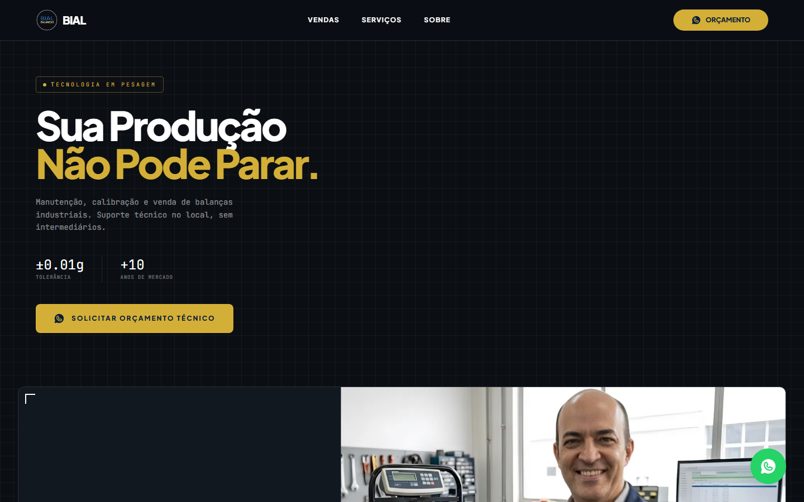

# Bial Balanças — Landing Page


Landing page de alta performance para a **Bial Balanças**, empresa especialista em pesagem, venda e manutenção de balanças e impressoras térmicas. Construída para transmitir autoridade técnica e converter visitantes em pedidos de orçamento via WhatsApp.

**[→ Ver o projeto no ar](https://bial-balancas.vercel.app/)**

---

## Demonstração

| Desktop | Mobile |
| :---: | :---: |
|  |  |

---

## O Desafio

O objetivo era transformar a presença digital da Bial numa ferramenta de autoridade técnica para clientes B2B (supermercados, padarias, indústrias). O setor industrial exige confiança e precisão — por isso o design foi pensado para transmitir solidez, usando paleta institucional e imagens reais da operação técnica, além de facilitar ao máximo o pedido de orçamentos rápidos em dispositivos móveis, onde a urgência por reparos costuma ser maior.

## A Solução

Landing page construída com **React + Vite**, com foco em três pilares:

- **Conversão** — CTAs estratégicos em cada seção e botão flutuante direcionando direto para o WhatsApp do especialista, com mensagem pré-preenchida por contexto.
- **Identidade industrial-técnica** — tema escuro com grade de fundo tipo blueprint, tipografia monoespaçada para dados técnicos e a dupla azul-marinho/dourado extraída diretamente da logo da marca.
- **Performance** — Bundling e dev server via Vite, imagens otimizadas em WebP, para carregamento rápido mesmo em conexões móveis.

## Destaques Técnicos

- **Componentização** — arquitetura de componentes independentes por seção (`Navbar`, `Hero`, `Stats`, `Sobre`, `Processo`, `Portfolio`, `Vitrine`, `Servicos`, `FAQ`, `Footer`), cada um com responsabilidade única.
- **Hooks de animação customizados** — `useInView` (`IntersectionObserver` reutilizável) e `useCountUp` (parsing de prefixo/número/sufixo + `requestAnimationFrame`) implementados do zero para os contadores animados dos Stats e os conectores progressivos da seção Processo, sem depender de biblioteca externa.
- **Configuração centralizada** — número e mensagens do WhatsApp isolados em `src/config.js`, evitando duplicação de link hardcoded pelos componentes.
- **Responsividade híbrida mobile-first** — Navbar com CSS Grid no desktop que se transforma em menu hambúrguer interativo no mobile; seção Processo alterna entre layout horizontal (desktop) e vertical (mobile).
- **Gerenciamento de estado** — uso de `useState` para controlar abertura do menu mobile e do acordeão de FAQ de forma reativa.
- **Animações no scroll** — biblioteca AOS para revelações genéricas, combinada com os hooks customizados para os momentos de destaque (Hero, Stats, Processo).

## Stack Técnica

| Categoria | Tecnologia |
| --- | --- |
| Biblioteca / Build | React 19, Vite |
| Estilização | Tailwind CSS 4, CSS3 (Grid, Flexbox, variáveis nativas, Keyframes) |
| Ícones | Phosphor Icons |
| Animação | AOS (Animate On Scroll) |
| Qualidade | ESLint |

## Como Rodar o Projeto Localmente

```bash
git clone https://github.com/rikelmedev/bial-balancas.git
cd bial-balancas
npm install
npm run dev
```

## Próximos Passos

- **Catálogo dinâmico** — integração com um CMS ou API para o próprio cliente adicionar/remover produtos da vitrine sem alterar código.
- **Testes automatizados** — testes de componentes para garantir que atualizações futuras não quebrem a interface.
- **Internacionalização** — suporte a múltiplos idiomas, caso a empresa decida expandir fronteiras.
- **SEO local e analytics** — dados estruturados (JSON-LD) e rastreamento de conversão dos cliques em WhatsApp.

---

Feito por [Rikelme](https://github.com/rikelmedev).
