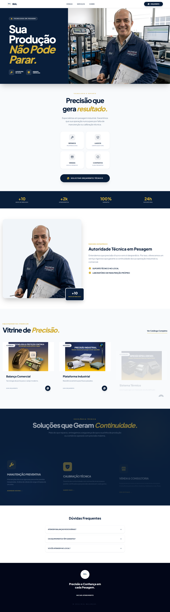

# 🚀 Landing Page - Bial Balanças

Este projeto é uma landing page de alta performance desenvolvida para a **Bial Balanças**, uma empresa especialista em pesagem, venda e manutenção de balanças e impressoras térmicas. O foco principal foi criar uma experiência de utilizador fluida, uma interface "premium" e totalmente responsiva para maximizar a conversão de orçamentos.

> **🔗 Link para o projeto (Deploy):** https://bial-balancas.vercel.app/

---
📸 Evolução do Projeto (Antes vs. Depois)
A versão 2.0 focou em elevar a autoridade visual da marca, saindo de um layout genérico para uma interface de alto impacto industrial.

## 📸 Demonstração

| Versão Desktop | Versão Mobile (Responsivo) |
| :--- | :--- |
|  | 
| | |

---

##📌 O Desafio
O objetivo era transformar a presença digital da Bial numa ferramenta de autoridade técnica. O setor industrial exige confiança e precisão; por isso, o design foi repensado para transmitir solidez, utilizando uma paleta de cores institucional e imagens reais da operação técnica.

##🛠️ Stack Técnica (Modern Web Stack)
-React 19: Utilização das versões mais recentes para uma interface reativa e performática.

-Tailwind CSS v4: Estilização atómica moderna, utilizando as novas capacidades de variáveis e temas da v4.

-Vite: Bundler de próxima geração para um desenvolvimento ultrarrápido.

-AOS & Phosphor Icons: Micro-interações fluidas e ícones vetoriais leves.

##🧠 Decisões de Engenharia & Arquitetura
1. Refatoração para Componentização
Migrei o projeto de um ficheiro único para uma Arquitetura de Componentes Independentes. Cada secção do site (Navbar, Hero, Vitrine, FAQ, etc.) possui agora o seu próprio ficheiro, seguindo o princípio da Responsabilidade Única.

2. Design de Autoridade Industrial (Split-Screen)
Implementei um layout de tela dividida no Hero com blocos sólidos de cor e cortes poligonais (clip-path). Esta decisão técnica garante contraste máximo para o texto de conversão, enquanto mantém a visibilidade limpa da fotografia industrial.

3. Responsividade Híbrida e Mobile-First
A interface foi construída para ser 100% responsiva, com uma Navbar inteligente que transita para um menu hambúrguer interativo, garantindo que o pedido de orçamento esteja sempre a um toque de distância.

##🚀 Como rodar o projeto localmente
Clone este repositório: git clone https://github.com/rikelmedev/bial-balancas.git

Instale as dependências: npm install

Inicie o servidor de desenvolvimento: npm run dev
