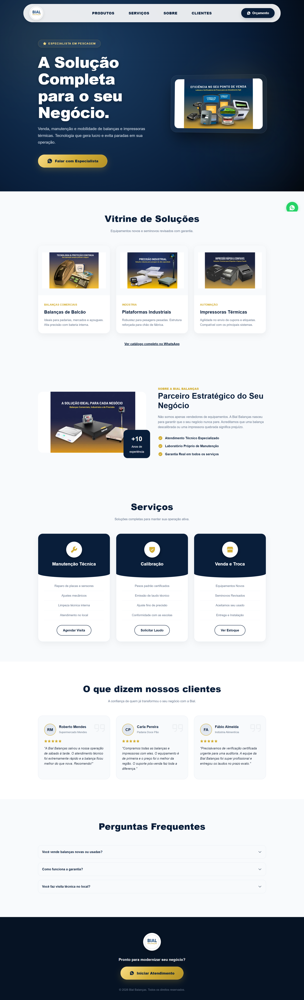

# 🚀 Landing Page - Bial Balanças

Este projeto é uma landing page de alta performance desenvolvida para a **Bial Balanças**, uma empresa especialista em pesagem, venda e manutenção de balanças e impressoras térmicas. O foco principal foi criar uma experiência de utilizador fluida, uma interface "premium" e totalmente responsiva para maximizar a conversão de orçamentos.

> **🔗 Link para o projeto (Deploy):** https://bial-balancas.vercel.app/

---

## 📸 Demonstração

| Versão Desktop | Versão Mobile (Responsivo) |
| :--- | :--- |
|  | |

---

## 📌 Problema
A empresa precisava de uma presença digital moderna e com autoridade que transmitisse confiança aos clientes (supermercados, padarias, indústrias). O objetivo era destacar os serviços de manutenção e venda, além de facilitar ao máximo o pedido de orçamentos rápidos, especialmente para utilizadores em dispositivos móveis (onde a urgência por reparos é maior).

## 💡 Solução
Desenvolvi uma landing page moderna utilizando **React + Vite**. A solução focou em:
* **Conversão:** Botões de *Call to Action* (CTA) estratégicos e um botão flutuante direcionando diretamente para o WhatsApp do especialista.
* **UX/UI Premium:** Design sofisticado utilizando o conceito de *Glassmorphism* (efeito de vidro 3D) e uma paleta de cores institucional (Azul Marinho e Dourado).
* **Prova Social:** Inclusão de uma secção de depoimentos de clientes para gerar confiança imediata.
* **Performance:** Carregamento ultrarrápido garantido pelo *bundler* Vite.

## 🛠️ Stack Técnica
* **React 19**: Biblioteca principal para construção da interface e componentização.
* **Vite**: Ferramenta de build para garantir velocidade no desenvolvimento e execução.
* **CSS3 Puro**: Estilização avançada utilizando CSS Grid, Flexbox, variáveis nativas (`:root`) e animações Keyframes.
* **Phosphor Icons**: Biblioteca de ícones vetoriais modernos e leves.
* **AOS (Animate On Scroll)**: Biblioteca para animações fluidas baseadas no scroll da página.

## 🧠 O que eu aprendi / Decisões técnicas
* **Glassmorphism e UI 3D:** Aprofundei os meus conhecimentos em CSS ao criar cartões com efeito de vidro (`backdrop-filter: blur`), gradientes radiais complexos e perspetivas 3D no momento em que o utilizador passa o rato por cima da imagem Hero.
* **Responsividade Híbrida (Mobile-First):** Desenvolvi uma Navbar inteligente que utiliza uma estrutura de 3 colunas em *CSS Grid* no Desktop, e transita suavemente para um *Menu Hambúrguer* interativo em ecrãs menores.
* **Gerenciamento de Estado Simples:** Utilizei o *hook* `useState` do React para controlar a abertura e o fecho do menu mobile de forma reativa.

## 🚀 Como rodar o projeto localmente
1. Clone este repositório: `git clone https://github.com/rikelmedev/bial-balancas.git`
2. Instale as dependências: `npm install`
3. Inicie o servidor de desenvolvimento: `npm run dev`

## 📈 O que eu melhoraria no futuro
* **Catálogo Dinâmico:** Integração com um CMS ou API para que o próprio cliente possa adicionar ou remover produtos da vitrine sem precisar alterar o código.
* **Testes Automatizados:** Implementaria testes básicos de componentes para garantir que atualizações futuras não quebrem a interface.
* **Internacionalização:** Prepararia a página para suportar múltiplos idiomas, caso a empresa decida expandir fronteiras.
